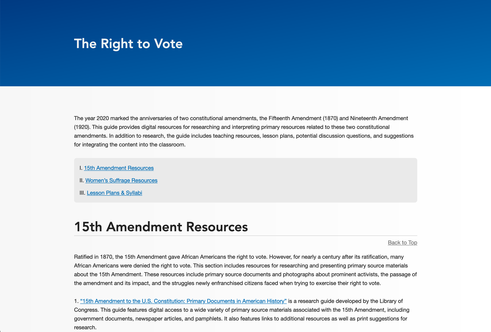
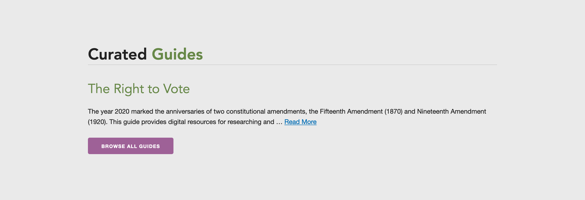

# CTC Guides

An Omeka plugin that adds shortcodes for displaying a list of Simple Pages sub-pages and adding a generated table of contents with back-to-top links. Created specifically for the Cleveland Teaching Collaborative to manage content guides using the default Simple Pages interface.

_adapted from [@ebellempire/BlogShortcode](https://github.com/ebellempire/BlogShortcode)_

## Using the `[guides]` Shortcode

Create a simple page to use as a the parent (for example, a page with the title of "Guides" and the slug "guides"). The slug is important because it will be the main way you control which posts appear. Create a listing of "posts" by adding new simple pages and organizing them as _children_ of the chosen "blog" page (for instance, setting the "parent page" to "Guides"). Add the `[guides]` shortcode to the page you want to serve as your guide directory. See options below.

### Options

- **parent**: the slug of the parent page whose child pages should be displayed. _String_ (default is `current page`)
- **number**: the max. number of child pages to display. _Number_ (default is `10`)
- **length**: the length of the text snippet (excerpt) for each child page. _Number_ (default is `500`)
- **author**: sets whether to display the name of the user who created the page. _Boolean_ (default is `true`)
- **date**: sets whether to display the date the page was created. _Boolean_ (default is `true`)
- **more**: sets wether to display the "read more" link after the text snippet. _Boolean_ (default is `true`)

### Example with no options

`[guides]`

Placing this on a simple page will display all children of that page as a detailed list, with the most recently-added at the top.

### Example with all options

`[guides parent="guides" number="10" length="200" author="false" date="true" more="true"]`

This example will diplay the _10_ most recent children of the page that has the slug _guides_. Each entry will display a _date_ in the byline but not an _author_ and the text snippet for each entry will be _200_ characters long, etc.

### Usage outside of Simple Pages

Theme developers may add support for usage anywhere on their Omeka site. For example, you could create a section on the homepage called Recent Guides and add the following to your homepage or other theme template.

```
<?php
echo $this->shortcodes([guides parent="guides" number="10" length="200" author="false" date="true" more="true"]);
?>
```

## Using the `[toc]` Shortcode

This one is simple. Just put `[toc]` anywhere on a page that is structured using `H2` elements and that area will display a linked table of contents for the page.Each `H2` will be given a unique `id` (careful, it will replace existing `id`s) and a "back to top" link will be appended after the `H2`. Basically, the result is like a standard old-school FAQ.

## Styles

Note that this plugin does not ship with any CSS. If you don't like the way something looks, you can address it in your theme's stylesheet.

## Screenshots




